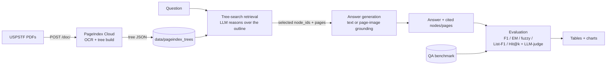

# Vectorless RAG on Clinical Guidelines — PageIndex + Gemini

A reasoning-based ("vectorless") retrieval pipeline that answers questions over long,
densely structured **USPSTF clinical-guideline PDFs** — no embeddings and no vector
database — with a paper-style evaluation harness and a Streamlit demo.

Instead of chunking a document and retrieving by embedding similarity, I index each PDF
as a hierarchical **tree of sections** ([PageIndex](https://pageindex.ai)) and let an LLM
*walk that tree* — reasoning over section titles and summaries the way a clinician scans a
table of contents — to find the section that answers a question. The answer is then
generated against that section, and scored against a hand-built QA benchmark.

---

## Why this problem

Clinical guidelines are a hard case for chunk-and-embed RAG: the answers are exact
artifacts — a numeric threshold (130/80 mm Hg), an age band (40–74 years), a list of
recommended tests — buried in deeply nested sections and frequently inside tables. I wanted
to test how well *tree-search* retrieval handles exactly that, and to measure it properly
rather than eyeballing a few answers.

What this repo demonstrates:

- A reproducible **index → retrieve → generate → evaluate** pipeline built around a single,
  carefully rate-limited and cached LLM client.
- **Hybrid grounding** — text by default, but the actual PDF **page image** is sent to the
  model (Gemini vision) for layout-sensitive question types, where OCR text tends to garble
  tables and figures.
- A **QA benchmark** across 5 guidelines and 4 question types, scored with
  token-F1 / Exact Match / fuzzy / List-Component F1 / retrieval Hit@k, plus an LLM-as-judge
  for borderline paraphrases — broken down per document and per question type.
- Engineering for a real free-tier budget: client-side rate limiting, on-disk response
  caching (re-runs cost zero quota), retry/backoff, model fallback, and a fully resumable
  evaluation.

---

## Architecture



**Design decisions worth calling out:**

- **PageIndex is used for indexing only.** I fetch each document tree once; all retrieval
  reasoning then runs on my own Gemini key. That keeps retrieval under full prompt control
  and costs zero per-query PageIndex credits.
- **Tree nodes carry no body text**, so at index time I also pull PageIndex's free per-page
  OCR markdown and attach it to each node. For `numeric_threshold`, `age_band_lookup`, and
  `list_based` questions I instead render the gold page to an image and send it to Gemini
  vision — more reliable on the tables these guidelines are full of. Switchable via
  `GROUNDING_MODE`.

---

## Results

I ran the pipeline end-to-end entirely on the **free tier**. Gemini's free-tier daily request
cap (~20/day on `gemini-2.5-flash`, and each question costs several calls) limited the set I
could validate end-to-end to **15 questions** — colorectal (9/9) and breast (6/9). The full
45-question benchmark and the harness are included and reproducible; the scores below are the
questions actually graded.

**Overall (15 questions):**

| Metric | Score |
|---|---|
| Final correct | **0.80** |
| Token-F1 | 0.70 |
| Fuzzy match | 0.73 |
| List-Component F1 | 0.83 |
| Retrieval Hit@k | 0.60 |
| Exact Match | 0.13 |

**By question type:**

| Question type | n | Token-F1 | Retrieval Hit@k | Final correct |
|---|---|---|---|---|
| age_band_lookup | 4 | 0.76 | 0.75 | 1.00 |
| list_based | 3 | 0.93 | 0.67 | 1.00 |
| numeric_threshold | 5 | 0.54 | 0.60 | 0.60 |
| information_extraction | 3 | 0.64 | 0.33 | 0.67 |

A few honest reads of these numbers: retrieval Hit@k (0.60) is the main lever — when the
right section is found, generation is strong (list and age-band questions score 1.0 final
correctness); `numeric_threshold` is hardest because the exact figure often sits in a table
cell that retrieval has to land on precisely. Exact Match is low by design — answers are full
sentences, so token-F1 and the judge are the better correctness signals.

Charts: `results/figures/`. Per-document and per-type CSVs: `results/`. The LLM-judge's
reasoning for borderline cases is logged to `results/judge_log.jsonl` for transparency.

---

## The benchmark

`data/qa/qa_dataset.csv` — 45 question/answer pairs (9 per guideline) across four question
types chosen to stress different skills: exact numeric extraction, conditional age-band
reasoning, multi-item list recall (List-Component F1), and paraphrase-tolerant extraction
(where the LLM-judge earns its keep). Each row records the reference answer and the exact
tree node / section / page where it lives.

## The 5 documents (USPSTF Final Recommendation Statements)

| Slug | Guideline | Pages |
|---|---|---|
| `colorectal_cancer_screening` | Colorectal Cancer: Screening | 26 |
| `breast_cancer_screening` | Breast Cancer: Screening | 27 |
| `hypertension_screening` | Hypertension in Adults: Screening | 13 |
| `depression_suicide_screening` | Depression and Suicide Risk in Adults: Screening | 21 |
| `prediabetes_diabetes_screening` | Prediabetes and Type 2 Diabetes: Screening | 15 |
| | **Total** | **102** |

---

## Setup

```bash
git clone <your-repo-url> && cd AGT-RAG
python -m venv .venv && source .venv/bin/activate   # Windows: .venv\Scripts\activate
pip install -r requirements.txt
cp .env.example .env        # then add your PAGEINDEX_API_KEY and GEMINI_API_KEY
```

- PageIndex key: <https://dash.pageindex.ai>
- Gemini key: <https://aistudio.google.com/apikey>

## Reproduce

```bash
python -m src.cli pages          # sanity-check page counts vs the free-tier cap
python -m src.cli index          # index the 5 PDFs with PageIndex (one-time, ~102 credits)
python -m src.cli validate-qa    # check the benchmark schema + gold-node references
python -m src.cli eval           # retrieve + generate + score every question (resumable, cached)
python -m src.cli report         # render charts to results/figures/
streamlit run app/streamlit_app.py
```

Ask a one-off question:

```bash
python -m src.cli ask --doc hypertension_screening \
  --q "What blood pressure threshold defines hypertension for screening?"
```

---

## Repository layout

```
config.py                  # paths, models, free-tier guards
src/
  cli.py                   # pages | index | validate-qa | ask | eval | report
  tree_utils.py            # load/traverse PageIndex trees, attach page text, render outlines
  llm/gemini_client.py     # rate-limit + retry + cache + model fallback (google-genai)
  indexing/                # PageIndex client + tree builder (page-cap guard)
  retrieval/tree_search.py # vectorless tree-search retrieval
  generation/              # hybrid text/vision grounding + answer generation
  evaluation/              # metrics, LLM-judge, eval runner, report charts
  data/validate_qa.py      # QA schema + gold-node validation
app/streamlit_app.py       # demo: Benchmark report (pass/fail table + drill-down) + live Ask
tests/test_metrics.py      # offline unit tests for the scoring functions
data/                      # pdfs/, pageindex_trees/, qa/, index_manifest.json
```

## Free-tier notes

- **PageIndex** charges 1 credit per page, once, at indexing. The 5 documents total ~102
  pages, within the 200-credit free tier. Retrieval runs on Gemini, so it spends no
  PageIndex credits.
- **Gemini** free tier is request-capped per day (currently ~20/day for `gemini-2.5-flash`).
  The client rate-limits, caches every response, retries on 429, and falls back to a
  secondary model; the evaluation is resumable, so a full run can be spread across days
  without re-spending quota.

## License

MIT — see [LICENSE](LICENSE). The guideline PDFs are public-domain U.S. government works
(uspreventiveservicestaskforce.org).
